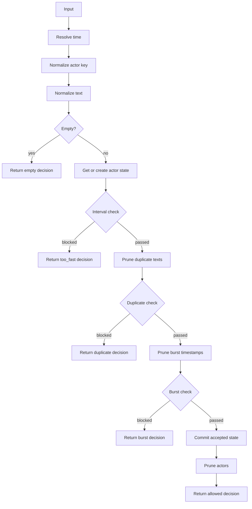
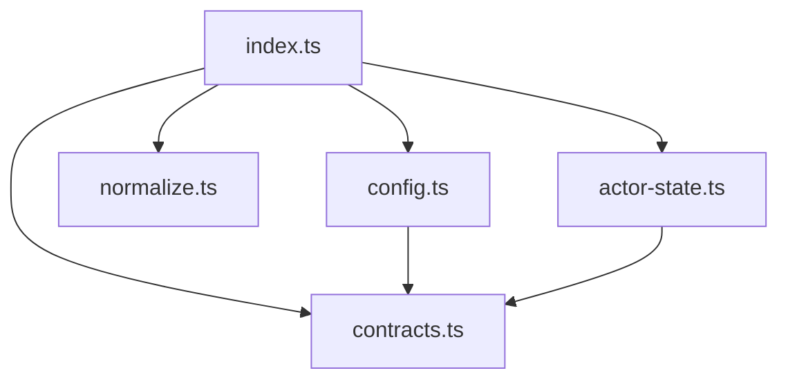

# Spam Filter Architecture

## Goals

The package provides a lightweight in-memory spam guard for composable text
moderation. It implements the `TextGuard` shape from `@textfilters/core`, so it
can be used next to the URL, phone, profanity, and other text filters without a
separate adapter.

Checks are deterministic per actor. The same normalized actor key owns the
interval, duplicate, and burst state used to decide future messages. By default,
state is updated only after a message passes every blocking check, which keeps
rejected messages from extending duplicate windows or increasing burst counters.
`trackRejectedAttempts` can opt into counting rejected interval, duplicate, and
burst attempts as future pressure.

This package is not a distributed rate-limit service. It does not coordinate
across processes, persist data, use timers, or talk to Redis, storage, queues, or
external services.

## Public API

`createSpamFilter(config?)` creates a stateful spam guard with optional
`SpamFilterConfig` settings.

`spamFilter(config?)` is a compatibility alias for `createSpamFilter(config?)`.

`SpamFilterConfig` controls:

- `minIntervalMs`: minimum time between accepted messages for one actor;
- `duplicateWindowMs`: time window for duplicate normalized text checks;
- `burstWindowMs`: time window for burst counting;
- `burstMaxMessages`: accepted messages allowed in the burst window;
- `maxActors`: maximum actor states retained in memory;
- `actorKeyPolicy`: keep missing actor keys in one shared unknown bucket, or
  reject missing actor keys;
- `clockPolicy`: accept finite caller-provided `nowMs` values, or always use the
  process clock;
- `trackRejectedAttempts`: whether rejected interval, duplicate, and burst
  attempts update actor state;
- `stateStore`: optional actor state storage used by the guard. Omitting it
  creates an isolated in-memory store for the filter instance.

`createInMemorySpamStateStore()` creates the default store implementation for
callers that want to share state between guard instances with matching state
policy settings without adding an external storage dependency. Filters with
different state policy windows keep separate actor buckets inside a shared
store.

`SpamFilterDecision` is either `{ allowed: true }` or
`{ allowed: false, reason }`.

Block reasons are:

- `empty`: normalized text is empty;
- `missing_actor`: `actorKeyPolicy: "reject_missing"` rejected a non-empty
  message without a normalized actor key;
- `too_fast`: the actor posted before `minIntervalMs` elapsed;
- `duplicate`: the actor repeated normalized text inside the duplicate window;
- `burst`: the actor exceeded the accepted-message burst limit.

`reset()` clears the configured actor state store scope for the filter instance.

## High-Level Flow

## Module Map

## File Responsibilities

| File                 | Responsibility                                                          | Out of scope                                           |
| -------------------- | ----------------------------------------------------------------------- | ------------------------------------------------------ |
| `src/index.ts`       | Public entrypoint, filter factory, decision order, and orchestration.   | Config validation details, normalization rules, or GC. |
| `src/contracts.ts`   | Public types, constants, block reasons, and exported filter contracts.  | Runtime state mutation or private helper policy.       |
| `src/config.ts`      | Defaults and config normalization for bounded integer settings.         | Decision flow or actor state mutation.                 |
| `src/normalize.ts`   | Text normalization, actor key normalization, and fallback actor bucket. | Duplicate, burst, or actor pruning logic.              |
| `src/actor-state.ts` | Actor state creation, duplicate pruning, burst pruning, and map bounds. | Public API exports or top-level filter orchestration.  |

## Decision Order

The filter applies blocking checks in a fixed order:

1. empty normalized text;
2. minimum interval;
3. duplicate normalized text;
4. burst count;
5. accepted-state commit.

Rejected messages return immediately. With the default
`trackRejectedAttempts: false`, they do not extend duplicate windows, add burst
timestamps, change `lastMessageAt`, or update the compatibility fields. With
`trackRejectedAttempts: true`, rejected interval, duplicate, and burst attempts
update the same actor state fields as accepted messages.

## State Model

Each actor key maps to one `ActorState`. Missing, empty, or whitespace actor keys
are normalized into a stable unknown actor bucket so stateless callers still get
deterministic checks. Set `actorKeyPolicy: "reject_missing"` for authenticated
server-side moderation surfaces where a missing actor identity should be a
policy failure instead of shared state.

`timestamps` stores accepted message times used by the burst window. Expired
timestamps are pruned before the burst check.

`lastMessageAt` stores the most recent accepted message time for interval
checks.

`recentNormalizedTexts` stores normalized accepted text and its accepted time for
duplicate-window checks.

`lastNormalizedText` and `lastTextAt` remain in `ActorState` as
compatibility/runtime fields. They are updated only during the accepted-state
commit.

`reset()` clears the actor map and removes all interval, duplicate, and burst
history for the filter instance.

## Normalization

Text normalization strips zero-width characters, applies NFKC lowercasing through
`@textfilters/core`, collapses repeated whitespace, caps normalized messages to
the current maximum length, and trims the result.

Actor key normalization also strips zero-width characters and applies NFKC
lowercasing through `@textfilters/core`. Empty normalized actor keys fall back to
the stable unknown actor bucket unless `actorKeyPolicy: "reject_missing"` is
enabled.

## Configuration

Defaults:

- `minIntervalMs`: `700`;
- `duplicateWindowMs`: `12000`;
- `burstWindowMs`: `10000`;
- `burstMaxMessages`: `6`;
- `maxActors`: `3000`;
- `actorKeyPolicy`: `"shared_unknown"`;
- `clockPolicy`: `"input_or_system"`;
- `trackRejectedAttempts`: `false`.

Invalid config values fall back to defaults. Bounded settings reject non-numbers,
non-finite numbers, values below their minimum, and values above
`Number.MAX_SAFE_INTEGER`. They are rejected instead of silently becoming
unbounded so a bad option cannot disable a guard by expanding a window, actor
limit, or message limit to an unsafe value.

`minIntervalMs` accepts `0`, which disables interval checks. Other bounded
settings require at least `1`.

`actorKeyPolicy: "shared_unknown"` preserves compatibility by grouping missing
actor keys into one unknown bucket. `actorKeyPolicy: "reject_missing"` rejects
non-empty messages that do not include a normalized actor key.

`clockPolicy: "input_or_system"` preserves deterministic tests and trusted
server callers by accepting finite `nowMs` values, falling back to `Date.now()`
otherwise. `clockPolicy: "system"` ignores `nowMs` and always uses `Date.now()`.

`trackRejectedAttempts: false` preserves compatibility by only committing state
for allowed messages. `trackRejectedAttempts: true` commits rejected interval,
duplicate, and burst attempts so repeated failures keep pressure on the same
actor.

## Memory Bounds

Actor state is stored in an in-memory map. The retention window is the largest of
`minIntervalMs`, `duplicateWindowMs`, and `burstWindowMs`.

When the actor map grows past `maxActors`, expired actors are pruned first.
Actors with `lastMessageAt` older than the retention window are removed.

If the map is still oversized after expired actor pruning, the oldest active
actors are evicted by `lastMessageAt` until the map is within the configured
limit. Eviction uses deterministic single-pass oldest selection instead of
sorting the full actor map on every overflow.

## Server-Side Policy Recommendation

For authenticated chat moderation surfaces, prefer:

- `actorKeyPolicy: "reject_missing"` so missing actor identity cannot share a
  process-wide bucket;
- `clockPolicy: "system"` so client-provided timestamps cannot weaken interval,
  duplicate, or burst checks;
- `trackRejectedAttempts: true` when repeated rejected attempts should maintain
  pressure on the actor.

## Change Guide

| Change                               | Primary files                         |
| ------------------------------------ | ------------------------------------- |
| Change public contracts              | `src/contracts.ts` + public API tests |
| Change defaults/config validation    | `src/config.ts` + tests               |
| Change text or actor normalization   | `src/normalize.ts` + tests            |
| Change duplicate/burst/actor pruning | `src/actor-state.ts` + tests          |
| Change decision order                | `src/index.ts` + behavior tests       |

## Safety Rules

- Do not expose internal state helpers as public API.
- Do not update state before all blocking checks pass.
- Do not silently allow invalid config to disable guards.
- Do not make this package depend on timers, storage, Redis, or external
  services.
- Keep tests public-API oriented.
